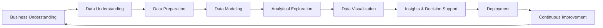
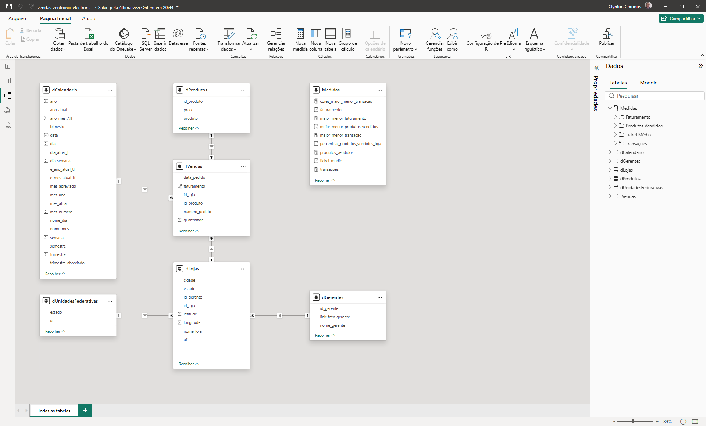
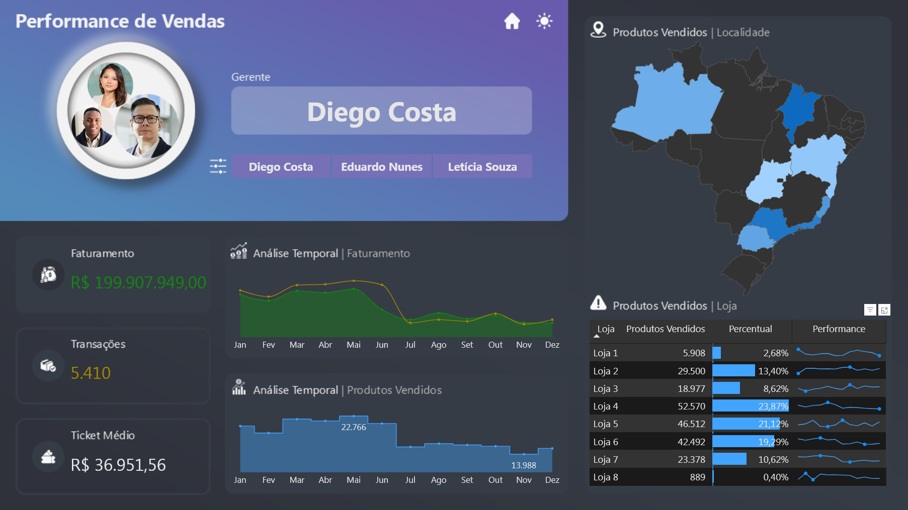

# Projeto Vendas — Zentronix Electronics
  

## 📊 Visão Geral

Este projeto apresenta um **dashboard de performance de vendas**, desenvolvido em **Power BI**, para a empresa fictícia **Zentronix Electronics**.

A solução permite acompanhar indicadores estratégicos como faturamento, volume de transações e ticket médio, analisando a performance de gestores, a evolução temporal das vendas e a distribuição geográfica, apoiando decisões comerciais mais assertivas.

🔎 **[Dashboard Interativo](https://app.powerbi.com/view?r=eyJrIjoiNGZjYThkMDQtNjY5ZS00ODY5LWE0NzktMmRiNTI2YzczODg1IiwidCI6IjIzY2FjN2VlLWYxZDgtNDMzOS1hYTdiLTc4MWFhOWY5MjI1YiJ9)**  

---

## 🧠 Contexto do Problema

A área comercial da **Zentronix Electronics** enfrentava desafios na análise integrada de:

- desempenho de vendas por gerente
- evolução temporal de faturamento e transações
- volume de produtos comercializados
- distribuição geográfica das vendas

Essas limitações dificultavam a identificação de padrões, tendências de desempenho e variações regionais, impactando diretamente a tomada de decisão comercial e o acompanhamento da performance dos gestores.

---

## 🎯 Abordagem Estratégica

Para resolver esses desafios, foi desenvolvida uma solução analítica utilizando **Power BI**, estruturada com **modelagem de dados** e organização de indicadores estratégicos de vendas.

O dashboard foi projetado para oferecer:

- leitura executiva clara
- análise detalhada de performance comercial
- navegação intuitiva entre gestores e visões analíticas  

### KPIs principais

- Faturamento
- Transações
- Ticket Médio

---

## 🧠 Metodologia Aplicada — BOSS BI Framework

> Este projeto foi desenvolvido utilizando o BOSS BI Framework (Business-Oriented Smart Solutions), uma metodologia proprietária desenvolvida para estruturar projetos de Business Intelligence e Analytics, focada na geração de valor estratégico, consistência analítica e suporte à tomada de decisão.

## 🔷 Fluxo do BOSS BI Framework

## 📌 Detalhamento das Etapas

### 🔹 1. Business Understanding
Definição do problema analítico e alinhamento com os objetivos estratégicos do negócio, garantindo que a solução gere valor real e mensurável.

---

### 🔹 2. Data Understanding
Mapeamento das fontes de dados e análise inicial para compreensão da estrutura, qualidade e granularidade das informações disponíveis.

---

### 🔹 3. Data Preparation
Tratamento, limpeza e transformação dos dados, assegurando consistência, padronização e confiabilidade para análise.

---

### 🔹 4. Data Modeling
Estruturação do modelo de dados utilizando boas práticas de modelagem dimensional, com foco em performance e escalabilidade.

---

### 🔹 5. Analytical Exploration
Exploração dos dados para identificação de padrões, tendências, correlações e possíveis anomalias relevantes ao negócio.

---

### 🔹 6. Data Visualization
Desenvolvimento de dashboards e relatórios interativos, aplicando princípios de visualização e Data Storytelling.

---

### 🔹 7. Insights & Decision Support
Geração de insights acionáveis e recomendações estratégicas para apoiar a tomada de decisão baseada em dados.

---

### 🔹 8. Deployment
Publicação e disponibilização da solução analítica, garantindo acesso, atualização e governança dos dados.

---

### 🔹 9. Continuous Improvement
Monitoramento contínuo e evolução da solução, adaptando-se às mudanças e novas necessidades do negócio.

---

## 📈 Impactos e Resultados

A solução permite:

- identificar padrões de desempenho de vendas ao longo do tempo
- analisar a performance de gestores e lojas
- compreender a distribuição geográfica das vendas
- comparar variações entre faturamento, volume e comportamento de consumo

Com isso, gestores conseguem tomar decisões mais estratégicas e orientadas por dados na condução da operação de vendas.

---

## 🧩 Estrutura do Dashboard

### 📊 **Indicadores Principais**

O dashboard apresenta três cartões principais:

### Faturamento

- valor total de vendas realizadas no período

### Transações

- quantidade de vendas efetuadas

### Ticket Médio

- valor médio por transação realizada

---

## 📊 Visualizações Analíticas

### 📈 **Análise Temporal de Vendas**

Gráfico de linhas apresentando:

- evolução do faturamento ao longo do tempo  
- comportamento das transações em eixo secundário  
- identificação de tendências e variações no período  

---

### 📦 **Volume de Produtos Vendidos**

Gráfico de linhas exibindo:

- quantidade de produtos comercializados ao longo do tempo  
- destaque para os períodos de maior e menor volume  

---

### 🗺️ **Distribuição Geográfica das Vendas**

Gráfico de mapa apresentando:

- volume de produtos vendidos por estado  
- intensidade representada por densidade de cor  

---

### 🏬 **Performance por Loja**

Tabela analítica exibindo:

- nome da loja  
- quantidade de produtos vendidos  
- percentual de participação no total  
- minigráfico com evolução ao longo do período  

---

### 👤 **Análise por Gerente**

Painel interativo permitindo:

- seleção de gerentes por meio de filtros dedicados  
- visualização da performance individual  
- acompanhamento integrado dos principais indicadores  

---

## 🎛️ Filtros Interativos

O dashboard permite análise dinâmica por:

- **Gerente**

Esse filtro permite explorar diferentes cenários analíticos.

---

## 🎨 Experiência de Navegação

O dashboard inclui recursos de usabilidade e design:

- 🌙 **Modo Dark (padrão)**
- ☀️ **Modo Light (opcional)**
- 🔎 botão **Analisar**
- 🏠 botão **Home**

Esses elementos melhoram a experiência de exploração dos dados.

---

## 🛠️ Stack Técnica

- Excel
- Power BI
- Power Query
- DAX (Data Analysis Expressions)
- Modelagem de Dados
- Storytelling com Dados
- PowerPoint

---

## 🧱 Modelagem de Dados

❄️ **Snowflake Schema**

Neste projeto, foi adotado o modelo Snowflake como estratégia de modelagem dimensional, priorizando a normalização controlada de dimensões para promover organização estrutural, governança de dados e reutilização de hierarquias.  

A decomposição de dimensões em múltiplas tabelas reduz redundâncias, melhora a consistência dos dados e permite maior flexibilidade na manutenção e evolução do modelo, especialmente em cenários com estruturas hierárquicas complexas, como dimensões geográficas ou categóricas.

Essa abordagem é especialmente útil em contextos que exigem padronização, reuso de entidades e maior controle sobre a integridade dos dados ao longo do tempo.

### **Tabelas Fato**

- vendas

### **Tabelas Dimensão**

- calendário
- produtos
- lojas
- estados brasileiros / UFs
- gerentes

Com isso, a solução proporciona maior padronização e consistência estrutural dos dados, permitindo análises mais confiáveis, melhor governança das informações e maior flexibilidade para evolução do modelo analítico conforme novas necessidades do negócio.

## 🗂️ Modelo de Dados

  

A modelagem foi estruturada para equilibrar normalização e desempenho, sendo possível sua adaptação para um modelo estrela em cenários que priorizem performance analítica.

---

# 📸 Preview do Dashboard

## Documentação das Medidas

Para consultar a documentação das medidas deste projeto, suas fórmulas e descrições, acesse a **[Documentação das Medidas](docs/medidas-documentacao.md)**.

# 👨‍💻 Autor

Projeto desenvolvido como parte do meu portfólio profissional em **Business Intelligence e Data Analytics**, destacando habilidades avançadas e aplicáveis a diversos cenários analíticos:

- Desenvolvimento de **dashboards executivos e painéis estratégicos**, focados em insights acionáveis e tomada de decisão baseada em dados  
- **Modelagem dimensional e relacional**, aplicando corretamente **cardinalidade, granularidade** e hierarquias entre tabelas para garantir consistência e integridade dos dados  
- **Transformação de dados com Power Query e Linguagem M**, criando pipelines eficientes, automatizados e auditáveis  
- Criação de **KPIs estratégicos e métricas customizadas em DAX**, para análise de performance e comparações confiáveis  
- **Integração de múltiplas fontes de dados** (Excel, SQL, APIs, arquivos planos), padronizando e validando informações críticas  
- **Data storytelling e visualizações interativas**, com cores, hierarquias, filtros e destaque de insights, para facilitar interpretação e engajamento do usuário  
- **Análises estatísticas e preditivas**, usando Python, R, regressões, teste de hipóteses, séries temporais e técnicas de Machine Learning para identificação de tendências e padrões  
- **Automatização e otimização de processos analíticos**, incluindo ETL, scripts e compressão de dados, garantindo performance e escalabilidade dos relatórios  
- **Documentação detalhada de medidas, tabelas, modelos e processos**, permitindo reprodutibilidade, transparência e governança dos dados  
- Aplicação de **boas práticas de engenharia de dados**, integrando análise, estatística, IA e visualização para soluções analíticas completas e confiáveis  
- Domínio completo de **Power BI, DAX, Power Query, Python e R**, com foco em performance, qualidade e entrega de insights estratégicos

---

  
**Portfólio de Business Intelligence & Data Analytics**  

  

---

💼 Aberto a oportunidades em Business Intelligence & Data Analytics

| [LinkedIn](https://www.linkedin.com/in/rogério-clynton-ribeiro/) | [Portfólio](https://clyntonboss.github.io/) | [e-Mail](mailto:clyntonribeiror@gmail.com) | [WhatsApp](https://wa.me/5524999240768) |

